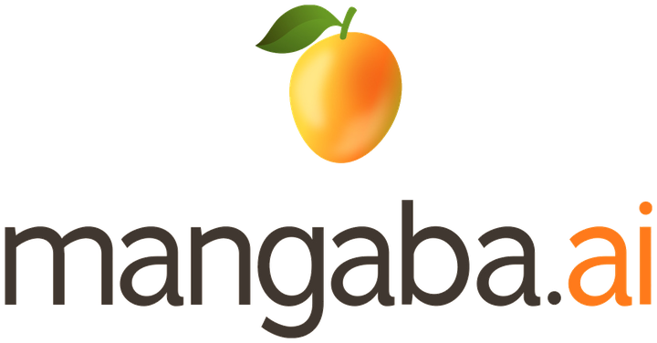
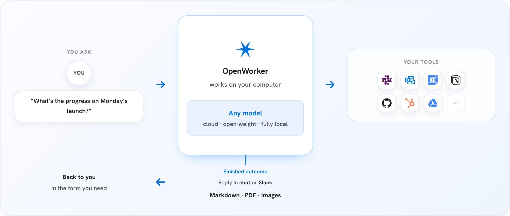

<p align="center">
  
</p>

<p align="center">
  <b>IA que entrega o trabalho pronto — não só a conversa.</b><br>
  <sub>Agente de IA que roda no seu computador, com o seu modelo e os seus dados · interface 100% em português</sub>
</p>

<p align="center">
  <a href="#instalar">Instalar</a> ·
  <a href="#mangaba-local-ia-sem-nuvem-e-sem-chave">IA local</a> ·
  <a href="#o-que-ele-faz">O que faz</a> ·
  <a href="#privacidade">Privacidade</a> ·
  <a href="#rodando-a-partir-do-código">Rodar do código</a>
</p>

<p align="center">
  <a href="https://github.com/dheiver2/mangaba-openworker/releases/latest"></a>
  
  
</p>

---

> **Beta.** Totalmente usável e em polimento ativo. Fork brasileiro do
> [OpenWorker](https://github.com/andrewyng/openworker), com interface, prompts e documentação
> em **português do Brasil** — veja [Créditos](#créditos).

O Mangaba vive no seu computador e devolve **trabalho terminado**: um documento pronto, um
parecer com as contas feitas, a agenda organizada, a caixa de entrada triada. Ele não te
prende a nenhum modelo — traga a sua chave da OpenAI, Anthropic, Google, DeepSeek e afins,
**ou rode tudo local, sem chave e sem nuvem** (Mangaba Local). Seus dados só saem daqui pelo
modelo e pelas
integrações que **você** escolher.

[](https://mangaba-downloads.vercel.app)

## Instalar

**[⬇️ Página de downloads](https://mangaba-downloads.vercel.app)** — sempre com a versão mais recente.

| Sistema | Download | Pelo terminal |
|---|---|---|
| **macOS** (Apple Silicon) | [`.dmg`](https://github.com/dheiver2/mangaba-openworker/releases/latest) | `brew tap dheiver2/mangaba && brew install --cask mangaba` |
| **Windows** (x64) | [`.exe`](https://github.com/dheiver2/mangaba-openworker/releases/latest) | `winget install DheiverSantos.Mangaba` *(em aprovação)* |

Abra o app, **crie a senha de acesso** e peça algo de verdade — com a sua chave de API ou
com o Mangaba Local (veja abaixo).

> **Instaladores ainda não assinados.** No macOS: Ajustes do Sistema ▸ Privacidade e
> Segurança ▸ "Abrir Mesmo Assim" na primeira execução. No Windows: SmartScreen ▸ "Mais
> informações" ▸ "Executar assim mesmo". Confira o SHA-256 no arquivo de checksums da release.

### Atualizações automáticas

A partir da **v0.1.16** o app se atualiza sozinho: verifica novas versões a cada 30 minutos,
baixa em segundo plano e oferece **"Reiniciar para atualizar"** — com verificação de
assinatura (minisign) de ponta a ponta. Nunca troca o app por baixo de você no meio de uma
tarefa; a atualização é sempre um convite, não uma imposição.

*Quem estiver numa versão anterior à 0.1.16 precisa baixar manualmente uma última vez.*

### Com Docker

Um container só — o servidor Python serve a própria interface:

```shell
docker compose up -d
```

Abra http://127.0.0.1:8765, crie a senha e pronto. A porta é publicada apenas em
`127.0.0.1`. Os dados persistem no volume `mangaba-dados` e a pasta `~/Mangaba` fica
visível ao agente.

## Mangaba Local: IA sem nuvem e sem chave

O provedor **Mangaba Local** roda os modelos neste computador, com **tool calling nativo** —
o agente lê arquivos, roda comandos e usa conectores sem nenhuma chave de API.

- O app baixa o motor sozinho (llama.cpp, ~20 MB, sem admin) para a pasta de estado.
- Um clique baixa o **maior modelo Qwen3 que a SUA máquina aguenta**, pela RAM detectada:

  | Memória RAM | Modelo recomendado | Download |
  |---|---|---|
  | menos de 6 GB | Qwen3 4B | ~2,5 GB |
  | 6 a 12 GB | Qwen3 8B | ~5,0 GB |
  | 12 a 24 GB | **Qwen3 14B** | ~9,3 GB |
  | 24 GB ou mais | **Qwen3 32B** | ~20,2 GB |

  Só oferecemos quantização **Q4_K_M**: abaixo disso a qualidade cai rápido demais para
  valer o download.

Modelos locais **não enviam nada para fora** — nem prompt, nem arquivo, nem metadado.

## O que ele faz

- **Entregáveis de verdade** — documentos, planilhas, relatórios e páginas aparecem como
  arquivos prontos para abrir e compartilhar, não como texto no chat.
- **Usa suas ferramentas** — 33 conectores, entre eles GitHub, Slack, Jira, Notion, Linear,
  HubSpot, Outlook, monday.com, Gmail e Google Agenda — além do seu **terminal e arquivos
  locais**. Qualquer ferramenta que fale [MCP](https://modelcontextprotocol.io/) também
  entra, com controle por ferramenta.
- **Trabalha pelo Slack** — mencione o `@Mangaba` num canal: a sessão abre no seu computador,
  o trabalho acontece com as suas ferramentas e a resposta volta na thread.
- **Roda no horário** — automações para o recorrente: briefing matinal, relatório semanal,
  vigília num canal. Cada execução vira uma conversa com transcrição completa.
- **Pergunta antes de agir** — escritas, envios e comandos de shell passam por aprovação.
  Sem supervisão, os pedidos ficam na caixa de entrada em vez de o agente decidir sozinho.

### Como funciona

1. Diga o **resultado** que você quer — "prepare um parecer com estes exames", "desembarace
   minha agenda", "veja como está o release entre o Jira e o GitHub".
2. Ele divide em etapas e trabalha nos seus arquivos, no terminal e nos apps conectados.
3. Antes de algo sério — mandar mensagem, mexer na agenda, rodar comando — ele pergunta.
4. Você recebe o entregável pronto, não uma lista de tarefas.

```text
┌────────────────────────────────────────────────┐
│              app desktop Mangaba               │  shell nativo (Tauri) + interface React
├────────────────────────────────────────────────┤
│      servidor de agente local (Python)         │  motor · ferramentas · conectores
├───────────────┬────────────────┬───────────────┤
│  seus         │  suas          │  seu          │  tudo com as suas chaves,
│  arquivos     │  ferramentas   │  modelo       │  na sua máquina
│  & terminal   │  33 conectores │  qualquer um  │
└───────────────┴────────────────┴───────────────┘
```

## Escolha o seu modelo

14 provedores prontos — cole a chave e troque quando quiser:

**Mangaba Local** (sem chave) · **OpenAI** · **Claude** (Anthropic) · **Gemini** (Google) ·
**DeepSeek** · **Qwen** (Alibaba) · **Kimi** (Moonshot) · **GLM** (Z.ai) · **MiniMax** ·
**Mistral** · **Grok** (xAI) · **Meta** · **Together AI** · **Fireworks AI**

A lista curada marca o que já foi verificado para trabalho com ferramentas. Qualquer outro
identificador de modelo funciona por sua conta e risco.

## Segurança e acesso

O app abre atrás de uma **senha local**. O token do sidecar prova que a chamada saiu desta
máquina; a senha prova que é a **pessoa** certa nela.

- Guardada como hash PBKDF2-HMAC-SHA256 (salt de 16 bytes, 480 mil iterações) em
  `<state-dir>/passcode.json`, permissão `0600`. A senha em claro nunca é gravada nem
  registrada em log.
- Sessões vivem **só em memória** e duram 12 h: reiniciar o servidor exige a senha de novo.
- Cinco tentativas erradas bloqueiam por 60 segundos.
- Trocar a senha (Configurações ▸ Senha de acesso) exige a atual e derruba as outras sessões.

**Esqueceu a senha?** Apague `~/.config/mangaba/passcode.json` — o app pede uma nova na
próxima abertura. Não há recuperação: só o hash existe, e ele nunca sai da sua máquina.

## Privacidade

O Mangaba é *local-first*. Tudo mora na sua máquina: o laço do agente, suas conversas, os
tokens dos conectores e as chaves de modelo — no armazenamento local de segredos do app. A
única peça na nuvem é um serviço pequeno que intermedeia o OAuth dos conectores, e ele é
**opcional**: dá para usar o app sem entrar em conta nenhuma, conectando tudo com credenciais
criadas à mão. Com o Mangaba Local, nem o modelo sai daqui.

Além disso: filtros de privacidade removem remetentes e campos sensíveis antes de o agente
ver os resultados, e cada chamada de conector fica registrada na aba Atividade.

## Rodando a partir do código

Pré-requisitos: Python 3.10+, Node 20+ e — para o shell desktop — o toolchain do Rust via
[rustup](https://rustup.rs/).

```shell
git clone https://github.com/dheiver2/mangaba-openworker
cd mangaba-openworker

# 1. Bootstrap único — cria o venv Python em .venv
#    (no Windows, rode pelo Git Bash ou WSL)
bash packaging/setup_dev_env.sh

# 2. Suba o servidor de agente local
.venv/bin/mangaba-server --cwd ~/algum/projeto --port 8765
#    (Windows: .venv\Scripts\mangaba-server.exe)

# 3. Em outro terminal, suba a interface
cd surfaces/gui
npm install
npm run dev        # interface no navegador, na porta do Vite
```

> Se o `python3` do sistema for anterior ao 3.10, crie o venv com uma versão mais nova antes
> do passo 1 — por exemplo `uv venv --python 3.12 .venv`.

Para o app desktop completo em vez da interface no navegador, troque o passo 3 por
`npm run tauri dev` — o shell Tauri abre a janela e supervisiona o servidor.

O servidor standalone cria um token por execução em `<state-dir>/sidecar-8765.token`; o Vite
lê esse arquivo ao iniciar. Para chamadas diretas à API, mande o valor no cabeçalho
`X-Mangaba-Token` — e, se já houver senha, a sessão em `X-Mangaba-Session`. O app desktop usa
um token em memória e nunca o grava em disco.

### Testes

```shell
.venv/bin/pytest                      # backend Python
cd surfaces/gui && npm test           # unidade da interface (vitest)
cd surfaces/gui && npm run e2e        # ponta a ponta com rede mockada (Playwright)
```

Estado atual: **971 testes Python** e **96 de unidade** passando. Na suíte e2e, 136 passam e
cerca de 30 ainda esperam textos em inglês — dívida da tradução das assertivas, não regressão
de comportamento.

### Empacotamento

```shell
bash packaging/build_dmg.sh                   # macOS (.dmg + artefatos de auto-update)
bash packaging/build_windows_cross.sh         # Windows (.exe), por cross-compile no macOS
bash packaging/testar_windows_wine.sh         # fumaça do sidecar Windows sob Wine
bash packaging/gerar_latest_json.sh 0.1.18    # manifesto do auto-update
```

O build do Windows sai do macOS porque não há máquina nem runner Windows no projeto: o
sidecar vem do runtime *embeddable* oficial do Windows com wheels `win_amd64`. Como isso não
prova que o app funciona, `testar_windows_wine.sh` sobe o `mangaba-server.exe` **de verdade**
sob Wine e bate na API — foi assim que uma falha fatal de import (que passava por todas as
verificações estruturais) apareceu antes de chegar aos usuários. A GUI em Windows real ainda
precisa de teste manual.

Assinar as atualizações exige a chave privada do updater em `TAURI_SIGNING_PRIVATE_KEY`; sem
ela os builds saem sem os artefatos de auto-update e o `gerar_latest_json.sh` se recusa a
montar um manifesto que quebraria os clientes.

## Estrutura do repositório

| Diretório | O que tem dentro |
|---|---|
| `mangaba/` | Backend Python — motor do agente, provedores de modelo, conectores, cliente MCP, memória, automações, senha local |
| `surfaces/gui/` | App desktop — interface React + shell Tauri que supervisiona o servidor |
| `surfaces/landing/` | Landing page estática (PT-BR, responsiva, tema claro/escuro) |
| `packaging/` | Builds de instalador, manifesto de atualização, testes de empacotamento, bootstrap de desenvolvimento |
| `docs/` | Página de downloads, especificações de design e registros de decisão |
| `tests/` | Suíte de testes do backend |
| `stt/` | Sidecar de fala para texto (Rust), para a entrada de voz |
| `darktok/` | App experimental do ecossistema Mangaba |

## Créditos

Fork do [**OpenWorker**](https://github.com/andrewyng/openworker), de Andrew Ng e
colaboradores, rebrandizado como Mangaba e traduzido para o português do Brasil. Todo o
crédito pela arquitetura original é deles.

O motor é construído sobre o [**aisuite**](https://github.com/andrewyng/aisuite), biblioteca
Python leve com API unificada de chat-completions entre provedores de LLM, além de uma camada
de agentes com ferramentas, toolkits e suporte a MCP.

A IA local roda sobre o [**llama.cpp**](https://github.com/ggml-org/llama.cpp) (MIT) — na
interface aparece como "Mangaba Local", mas o motor por baixo é o llama.cpp e o crédito é
dele; os modelos são os [**Qwen3**](https://huggingface.co/Qwen) (Apache-2.0).

## Licença

MIT — veja [LICENSE](LICENSE).
